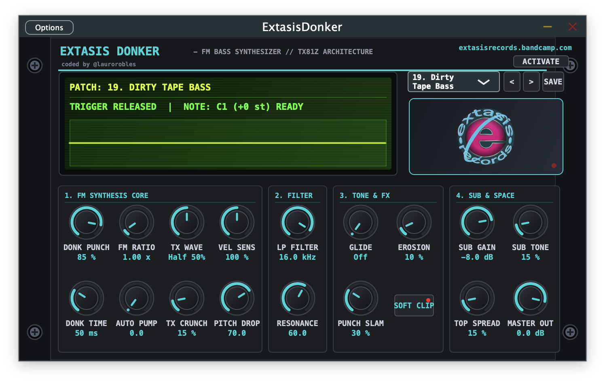

# 🪵 EXTASIS MARIMBA
### Mexican Physical-FM Synthesizer (VST3 / AU / Standalone)
**Developed & Coded by [@laurorobles](https://github.com/laurorobles) // [Extasis Records](https://extasisrecords.bandcamp.com)**

[](https://extasisrecords.bandcamp.com)
[](https://github.com/laurorobles)
[](https://github.com/laurorobles)
[](https://extasisrecords.bandcamp.com)


<p align="center">
  
</p>
---

## 🌟 Overview

**Extasis Marimba** is a specialized virtual synthesizer designed to capture the acoustic physics, timbral nuance, and unmistakable percussive soul of the **traditional Mexican marimba (Marimba Chiapaneca / Oaxaqueña)** alongside modern electronic mallet synthesis.

Unlike sample libraries that offer static velocity layers, **Extasis Marimba** synthesizes every strike in real time using a custom 24-bit / 96kHz **Modal Physical Modeling & Inharmonic FM Engine**.

---

## ✨ Core Physical Modeling Features

* 🪵 **Hormiguillo Wood Modal Resonator:** Emulates the non-linear modal vibration of tropical hardwood bars with dynamic *Key-Tracking* ratios ($1:3.15$ in bass $\to$ $1:3.60$ in treble).
* 🐝 **La Cachimba (Buzz Membrane Engine):** Physical recreation of the pig intestine membrane affixed with bee's wax at the base of the acoustic tube, providing the signature *«TAK–ÑAAANG–BRR»* harmonic bite on high-velocity strikes.
* 🥁 **Rubber Mallet Strike Noise:** Bandpassed transient burst (2.5 kHz – 5.5 kHz) simulating raw Mexican natural rubber mallets hitting hardwood.
* 🏺 **Acoustic Tube Cavity (DOOO~WONNNG):** Coupled resonator pipe with micro-detuned air beating ($\pm 3.5\text{--}6\text{ Hz}$) for full acoustic volume and 3D air movement.
* 🏘️ **"Marimba de Pueblo" Engine:** Deterministic per-key micro-imperfections in pitch ($\pm 6\text{ cents}$), decay ($\pm 18\%$), and membrane tension ($\pm 25\%$).
* 💾 **30 Curated Factory Presets + Full User Preset System:** Covers traditional folkloric marimba, Latin Club, Cumbia Rebajada, Balafon, Vibraphone, and experimental FM chimes.
* 🎛️ **Extasis Trigger Pad:** Centered audition pad with tactile visual feedback and vertical drag-to-tune functionality ($\pm 24\text{ semitones}$).

---

## 🚀 Quick Installation

### macOS (Apple Silicon & Intel)
1. Download the latest macOS release archive.
2. Run `install_mac.sh` or manually copy:
   * **VST3:** `~/Library/Audio/Plug-Ins/VST3/`
   * **AU:** `~/Library/Audio/Plug-Ins/Components/`
   * **Standalone:** `/Applications/`

### Windows (64-bit)
1. Download the Windows release archive.
2. Run `install_windows.bat` or copy `ExtasisMarimba.vst3` to `C:\Program Files\Common Files\VST3\`.

---

## 🛠️ Building from Source

### Prerequisites
* **CMake** (>= 3.22)
* **C++20** compatible compiler (Clang / AppleClang / GCC / MSVC)
* **JUCE 8** (Embedded or system installed)

### Build Commands
```bash
# Clone the repository
git clone https://github.com/laurorobles/ExtasisMarimba.git
cd ExtasisMarimba

# Configure and Build Release
cmake -B build -DCMAKE_BUILD_TYPE=Release
cmake --build build --config Release --parallel
```

The compiled binaries will be generated under:
* `build/ExtasisMarimba_artefacts/Release/Standalone/ExtasisMarimba.app` (or `.exe`)
* `build/ExtasisMarimba_artefacts/Release/VST3/ExtasisMarimba.vst3`
* `build/ExtasisMarimba_artefacts/Release/AU/ExtasisMarimba.component`

---

## 📖 User Manual & Documentation
For detailed explanations of all 16 DSP parameters, preset guides, and production tips, read the [Official User Manual (MANUAL.md)](MANUAL.md).

---

## 🔒 License & Registration
Extasis Marimba operates with a **10-minute full-featured evaluation period**. Full licenses can be registered offline via 16-character serial key through the in-app `[ DEMO ]` badge.

---
*© Extasis Records — Made with ❤️ in Mexico.*


> **Licencias:** Consigue tu licencia oficial en [http://laurorobles.gumroad.com](http://laurorobles.gumroad.com)
